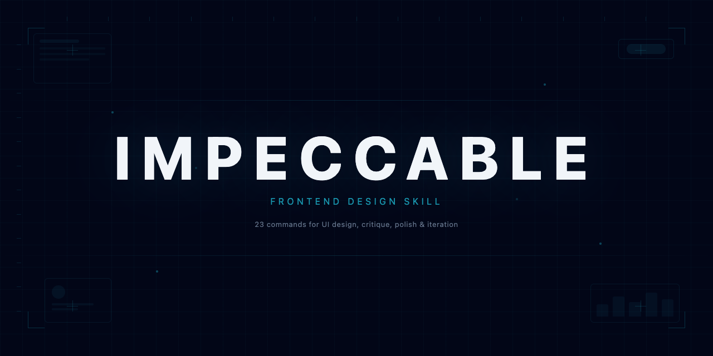
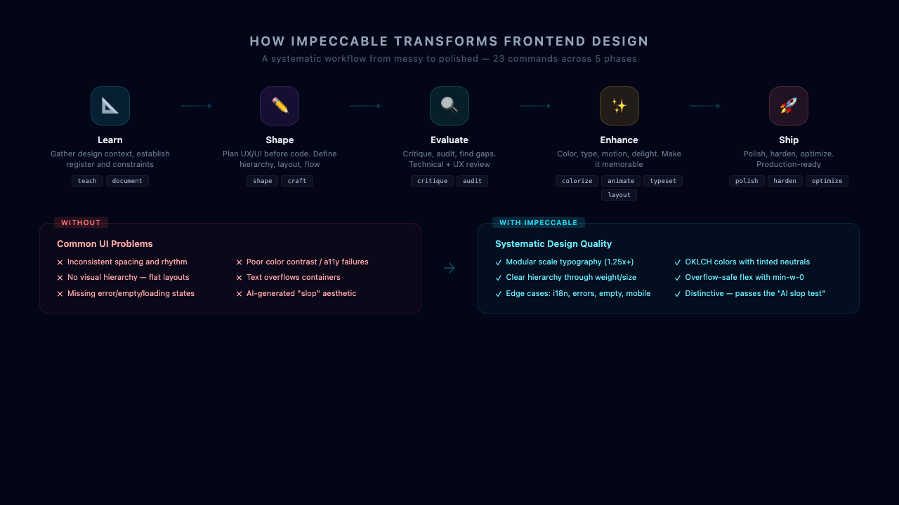

# Impeccable

<p align="center">
  
</p>

A comprehensive frontend design skill for [Hermes Agent](https://github.com/NousResearch/hermes-agent). 23 commands for shaping, auditing, polishing, and refining UI.

Based on [pbakaus/impeccable](https://github.com/pbakaus/impeccable) (Apache 2.0), which builds on Anthropic's frontend-design skill.

## What it does

<p align="center">
  
</p>

Impeccable designs and iterates production-grade frontend interfaces. Real working code, committed design choices, exceptional craft.

**5 phases, 23 commands:**

1. **Learn** — Gather design context (`teach`, `document`)
2. **Shape** — Plan UX/UI before code (`shape`, `craft`)
3. **Evaluate** — Critique and audit (`critique`, `audit`)
4. **Enhance** — Color, type, motion, delight (`colorize`, `animate`, `typeset`, `layout`, `delight`, `overdrive`)
5. **Ship** — Polish, harden, optimize (`polish`, `harden`, `optimize`)

### Commands

| Command                         | Category | Description                                                           |
| ------------------------------- | -------- | --------------------------------------------------------------------- |
| `impeccable:craft [feature]`    | Build    | Full shape-then-build flow with visual iteration                      |
| `impeccable:teach`              | Build    | One-time setup: gather design context, write PRODUCT.md and DESIGN.md |
| `impeccable:document`           | Build    | Generate DESIGN.md from existing project code                         |
| `impeccable:extract [target]`   | Build    | Pull reusable components and tokens into the design system            |
| `impeccable:shape [feature]`    | Build    | Plan UX/UI before writing code                                        |
| `impeccable:critique [target]`  | Evaluate | UX design review: hierarchy, clarity, emotional resonance             |
| `impeccable:audit [target]`     | Evaluate | Run technical quality checks (a11y, performance, responsive)          |
| `impeccable:polish [target]`    | Refine   | Final pass, design system alignment, and shipping readiness           |
| `impeccable:bolder [target]`    | Refine   | Amplify boring designs                                                |
| `impeccable:quieter [target]`   | Refine   | Tone down overly bold designs                                         |
| `impeccable:distill [target]`   | Refine   | Strip to essence                                                      |
| `impeccable:harden [target]`    | Refine   | Error handling, i18n, text overflow, edge cases                       |
| `impeccable:onboard [target]`   | Refine   | First-run flows, empty states, activation paths                       |
| `impeccable:animate [target]`   | Enhance  | Add purposeful motion                                                 |
| `impeccable:colorize [target]`  | Enhance  | Introduce strategic color                                             |
| `impeccable:typeset [target]`   | Enhance  | Fix font choices, hierarchy, sizing                                   |
| `impeccable:layout [target]`    | Enhance  | Fix layout, spacing, visual rhythm                                    |
| `impeccable:delight [target]`   | Enhance  | Add moments of joy                                                    |
| `impeccable:overdrive [target]` | Enhance  | Add technically extraordinary effects                                 |
| `impeccable:clarify [target]`   | Fix      | Improve unclear UX copy                                               |
| `impeccable:adapt [target]`     | Fix      | Adapt for different devices                                           |
| `impeccable:optimize [target]`  | Fix      | Performance improvements                                              |
| `impeccable:live`               | Iterate  | Visual variant mode: iterate on elements in the browser               |

### Registers

Every design task is either **brand** (marketing, landing, campaign, portfolio: design IS the product) or **product** (app UI, admin, dashboard, tool: design SERVES the product).

### Shared Design Laws

- **Color**: OKLCH, tinted neutrals, 4 strategies on the commitment axis (Restrained → Committed → Full Palette → Drenched)
- **Theme**: Physical scene forces the answer (dark vs light is never a default)
- **Typography**: 65–75ch body, ≥1.25 scale ratio between hierarchy steps
- **Layout**: Vary spacing for rhythm, cards are the lazy answer, nested cards are always wrong
- **Motion**: No CSS layout animation, ease-out with exponential curves
- **Anti-patterns**: Side-stripe borders, gradient text, glassmorphism as default, hero-metric template, identical card grids, modal as first thought

## Installation

### Hermes Agent

```bash
# Copy to your skills directory
cp -r reference/ ~/.hermes/skills/creative/impeccable/reference/
cp SKILL.md ~/.hermes/skills/creative/impeccable/
```

Or install via the hermes CLI:

```bash
hermes skills install impeccable
```

### Standalone CLI

The skill also ships a CLI for detecting UI anti-patterns:

```bash
npx impeccable detect src/                   # scan a directory
npx impeccable detect index.html             # scan an HTML file
npx impeccable detect https://example.com    # scan a URL (requires Puppeteer)
npx impeccable detect --fast --json .        # regex-only, JSON output
```

## Structure

```
impeccable/
├── SKILL.md              # Main skill definition
├── README.md             # This file
└── reference/            # 36 reference files
    ├── brand.md          # Brand register: marketing, landing, campaign pages
    ├── product.md        # Product register: app UI, dashboards, tools
    ├── typography.md     # Type systems, font pairing, modular scales, OpenType
    ├── color-and-contrast.md  # OKLCH, tinted neutrals, dark mode, accessibility
    ├── spatial-design.md # Spacing systems, grids, visual hierarchy
    ├── motion-design.md  # Easing curves, staggering, reduced motion
    ├── interaction-design.md  # Forms, focus states, loading patterns
    ├── responsive-design.md   # Mobile-first, fluid design, container queries
    ├── ux-writing.md     # Button labels, error messages, empty states
    ├── cognitive-load.md # Reduce cognitive overhead in interfaces
    ├── heuristics-scoring.md  # Nielsen-style heuristic evaluation rubric
    ├── craft.md          # Full shape-then-build flow
    ├── shape.md          # UX/UI planning before code
    ├── teach.md          # Setting up PRODUCT.md and DESIGN.md
    ├── document.md       # Generating DESIGN.md from existing code
    ├── extract.md        # Pulling tokens into design system
    ├── critique.md       # UX design review
    ├── audit.md          # Technical quality checks
    ├── polish.md         # Final quality pass
    ├── bolder.md         # Amplifying safe designs
    ├── quieter.md        # Toning down loud designs
    ├── distill.md        # Stripping to essence
    ├── harden.md         # Production readiness
    ├── onboard.md        # First-run flows and empty states
    ├── animate.md        # Purposeful animation
    ├── colorize.md       # Strategic color introduction
    ├── typeset.md        # Typography fixes
    ├── layout.md         # Layout and spacing fixes
    ├── delight.md        # Personality and memorable touches
    ├── overdrive.md      # Pushing past conventional limits
    ├── clarify.md        # UX copy improvements
    ├── adapt.md          # Device adaptation
    ├── optimize.md       # UI performance
    ├── live.md           # Browser variant iteration
    ├── personas.md       # User persona definitions
    └── codex.md          # Codex integration reference
```

## License

Apache 2.0 — same as the original [pbakaus/impeccable](https://github.com/pbakaus/impeccable).

## Credits

- [Paul Bakaus](https://github.com/pbakaus) — original impeccable skill
- [Anthropic](https://www.anthropic.com) — frontend-design skill foundation
- [Nous Research](https://nousresearch.com) — Hermes Agent integration
